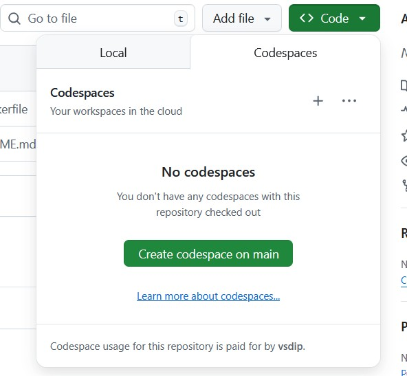

---

## VSD-EDA Environment (Xschem + Ngspice)

This Codespace provides a ready-to-use **schematic and circuit simulation** environment on **Ubuntu 22.04**, featuring **Xschem** and **Ngspice**, with both **terminal** and **GUI (noVNC)** access.

---

### Step 1 – Open the Codespace

1. Go to the GitHub repository:
   **[https://github.com/vsdip/vsd-7nm](https://github.com/vsdip/vsd-7nm)**
2. Click **“Code” → “Open with Codespaces”** to launch the environment in your browser.



---

### Option 1 – Use the Terminal

Once the Codespace opens, go to the **TERMINAL** tab and run:

```bash
xschem
```

or

```bash
ngspice
```

Exit anytime using `exit`.


---

### Option 2 – Use the GUI (noVNC Desktop)

1. In your Codespace, open the **PORTS** tab.
2. Find the forwarded port named **noVNC Desktop (6080)**.
3. Click the forwarded URL.
4. On the web page, select **`vnc_lite.html`** to open the XFCE desktop.
5. Inside the desktop terminal, run:

   ```bash
   xschem
   ngspice
   ```


---

### Installed Tools

| Tool    | Command   | Description               |
| ------- | --------- | ------------------------- |
| Xschem  | `xschem`  | Schematic Capture Tool    |
| Ngspice | `ngspice` | Circuit Simulation Engine |
| gedit   | `gedit`   | Lightweight Text Editor   |
| vim     | `vim`     | Terminal-based Editor     |

---

### Project Folder Location

The design files are available under the folder:
`/workspaces/vsd-7nm`
as shown in the image below:


---

### Verify Installation

```bash
xschem --version
ngspice -v
```

Both commands should display version information confirming installation.

---

